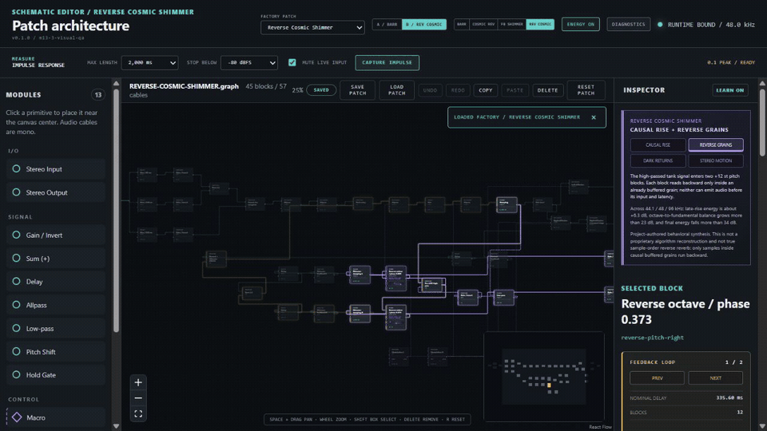

# Reverb Playground

Reverb Playground is a free, open-source visual reverb instrument for Windows. Instead of hiding an algorithm behind a few knobs, it shows the delays, allpasses, filters, modulation, feedback paths, and stereo routing that create the sound. You can listen, edit the schematic, and inspect how energy moves through it.

The project began as a visible, playable reconstruction of a Keith Barr/Alesis MIDIVerb-I-style architecture and has grown into a focused environment for learning and designing algorithmic reverbs.

*Reverse Cosmic Shimmer: inspect the signal path, focus the feedback architecture, and edit the sound continuously.*

## Download

For most people, the best choice is the current [Windows alpha release](https://github.com/dnrohr/reverb-playground/releases/tag/v0.1.0-alpha.1). Download `ReverbPlayground-0.1.0-windows-x64.zip`, extract the complete ZIP, and choose one of the included formats:

- **Standalone** — open `Standalone/Reverb Playground.exe`; no DAW is required.
- **VST3** — install the plug-in and open it as a stereo effect in a compatible DAW.

The project currently supports 64-bit Windows 10 and 11. Builds are not yet code-signed, so Windows SmartScreen may ask you to confirm that you trust the download. Only download builds from this repository, and use the supplied SHA-256 checksum if you want to verify the archive.

Developers and testers can also download the newest successful `main` build from the [Actions page](https://github.com/dnrohr/reverb-playground/actions/workflows/verify.yml). Open the newest successful **Verify** run and download its Windows artifact. These development builds are temporary and less stable than a release; each artifact includes the complete ZIP and a convenient standalone EXE.

## First run

1. Extract the downloaded ZIP. Do not run the application from inside the ZIP preview.
2. Open `Standalone/Reverb Playground.exe`.
3. Choose **Audio Device…** and select your stereo output.
4. Start at a conservative monitor level.
5. Load an audio file or use **Trigger Impulse** to hear the selected reverb.
6. Move a block or change a parameter and listen to the result continuously.

The initial screen may remain visible for eight seconds while the application opens. If the editor reports that WebView2 is unavailable, install Microsoft's [Evergreen WebView2 Runtime](https://developer.microsoft.com/microsoft-edge/webview2/) and reopen the application.

For a guided tour, follow [Getting started: hear and inspect the Barr reference](docs/getting-started-barr-tutorial.md).

## What you can explore

- A schematic editor with mono cables, stereo input/output, explicit sums, and visible feedback paths
- Delay, allpass, gain, low-pass, pitch-shift, modulation, envelope, and gate building blocks
- Barr-inspired, shimmer, reverse-style, gated, and gravity-controlled factory topologies
- Audio-file playback, looping, seeking, wet/dry comparison, and processed-file export
- Live energy, impulse response, decay, RT60, safety, and feedback-loop visualizations
- Continuous audible editing, undo/redo, copy/paste, and patch save/load
- Draft, Normal, and High processing policies that are saved with each patch
- Contextual explanations intended to teach through use

## Standalone or VST3?

Use the **standalone** when you want the simplest way to explore a topology or process an audio file. Use the **VST3** when you want Reverb Playground inside a DAW, synchronized with a session, or fed by live tracks and instruments.

For VST3 installation, run the included `install-vst3.ps1` script from PowerShell, or copy the complete `Reverb Playground.vst3` folder to `%LOCALAPPDATA%\Programs\Common\VST3`. Then rescan plug-ins in your DAW. See the complete [Windows installation and removal guide](docs/windows-package-installation.md).

## Alpha status and safety

Reverb Playground is alpha software. Save important patches, keep monitoring levels conservative, and expect the interface and patch library to evolve. Runaway feedback is detected and muted, but feedback-heavy designs can still change level quickly. The current reverse-style topology creates a causal rising-energy impression; it does not reverse future samples or create true pre-echo.

The latest published alpha and its known limitations are documented in the [release notes](docs/releases/v0.1.0-alpha.1.md).

## Help and feedback

Report reproducible bugs or documentation problems through [GitHub Issues](https://github.com/dnrohr/reverb-playground/issues). Include the version and 12-character commit shown in the editor, your Windows version, audio device or DAW, and the smallest safe reproduction you can share.

Useful references:

- [Module and visualization reference](docs/module-and-visualization-reference.md)
- [Module vocabulary and Advanced controls](docs/module-vocabulary-and-advanced-controls.md)
- [Filter and Mixer block decision](docs/filter-and-mixer-block-decision.md)
- [Processing quality modes](docs/quality-modes.md)
- [Why the visible graph executor remains the shipping path](docs/factory-specialization-decision.md)
- [Saving and loading patches](docs/patch-saving-and-loading.md)
- [Schematic editor interactions](docs/schematic-editor-interactions.md)
- [Keith Barr reverb architecture research](docs/keith-barr-reverb-architectures.md)
- [Large modulated, reverse, and shimmer topology research](docs/large-modulated-and-shimmer-reverb-topologies.md)
- [Dense figure-eight reference design](docs/dense-figure-eight-design.md)
- [Four-line FDN reference design](docs/four-line-fdn-design.md)
- [Current progress](docs/progress.md) and [roadmap](docs/roadmap.md)
- [Alpha demonstration video](artifacts/ui/m7-6-alpha-release/reverb-playground-alpha-demo.mp4)

## Developers and contributors

The project uses C++20, JUCE 8, CMake, and a web-based schematic editor. Build prerequisites and the verified commands are in the [development guide](docs/development.md); contribution expectations are in [CONTRIBUTING.md](CONTRIBUTING.md).

Reverb Playground is licensed under [GNU AGPLv3 only](LICENSE). Dependency terms and generated-asset provenance are documented in [Third-party notices](THIRD_PARTY_NOTICES.md) and [Asset provenance](ASSET_PROVENANCE.md). No transformed MIDIVerb ROM data is included.
