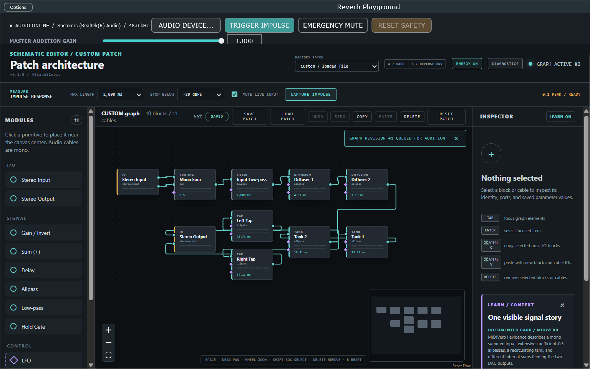

# Getting started: hear and inspect the Barr reference

This tutorial starts with the Windows alpha package and ends with a measured,
visually inspected Barr-inspired reverb. It does not require a development
toolchain or any MIDIVerb ROM data.

## Before you begin

1. Follow [Windows package installation](windows-package-installation.md) and
   open the standalone application.
2. In **Audio Device...**, choose a stereo output and use a conservative
   monitor level.
3. Confirm that the editor header shows `v0.1.0 / <commit>` and that the commit
   agrees with the package's `build-info.json`.
4. Keep **Master Audition Gain** low for the first impulse. **Emergency Mute**
   always silences output without changing the patch.

The packaged standalone should look like this:

## 1. Read the signal path

Choose **Barr Reference** in **Factory Patch** and press the canvas fit button
if the complete graph is not visible. Follow the solid mono cables from left to
right:

1. **Stereo Input** exposes separate `out-l` and `out-r` sockets.
2. **Sum (+)** combines those two mono cables. The following **Gain / Invert**
   block applies the visible `0.5` normalization.
3. **Low-pass** removes high-frequency energy before diffusion.
4. Four shared **Allpass** blocks diffuse the mono signal.
5. Two different terminal **Allpass** blocks create decorrelated left and
   right wet outputs.
6. **Stereo Output** receives one mono cable at `in-l` and one at `in-r`.

This is the project's documented Barr-inspired development reference, not a
cycle-accurate claim about a particular proprietary MIDIVerb preset. Its exact
topology and departures are recorded in
[Barr reference implementation](barr-reference-implementation.md).

## 2. Hear it safely

Press **Trigger Impulse** in the native strip. A short impulse enters at the
normalized mono-sum boundary and the output should become a brief, diffuse
stereo response. This audition button does not alter the graph.

Turn **Energy On** and trigger another impulse. Five-segment meters on the
runtime-bound blocks and changing cable width show measured RMS activity. The
motion should advance through the shared diffusion chain and then separate at
the two output branches. Turn **Energy Off** to stop both polling and native
sample scans. The operating system's reduced-motion preference can lock this
feature off.

## 3. Capture and inspect the response

In **Measure / Impulse Response**:

1. Select **500 ms** maximum length and **-80 dBFS** threshold.
2. Leave **Mute live input** enabled so room noise cannot contaminate the
   measurement.
3. Choose **Capture impulse**. The measurement stimulus is fixed at `0.1` peak
   and is captured before Master Audition Gain.
4. In the response viewer, identify the solid left waveform, dashed right
   waveform, and white stereo-energy decay.
5. Use **Early / 16x**, the zoom controls, wheel zoom, and the pan slider. These
   controls change only the view, never the samples or patch.

The viewer reports channel peaks, onset, visible time range, and a T30-derived
RT60 only when the captured decay supports a defensible estimate. A refusal
message is a valid result for silence, a truncated/noisy tail, or insufficient
fit data.

## 4. Inspect and change one primitive

Select an Allpass block. The right inspector shows its delay in milliseconds
and coefficient as a unitless value. Move the coefficient slightly while
listening or recapture the response. Edits are continuous, smoothed, and
published through a bounded topology transition; **Undo** restores the prior
value.

Keep the coefficient inside the displayed `-0.95` to `+0.95` stability bound.
Delay modulation uses a fractional linear tap and intentionally creates
Doppler/pitch movement. The complete limits and socket rules are in
[Module and visualization reference](module-and-visualization-reference.md).

## 5. Inspect safety and save your work

Open **Diagnostics**. The panel distinguishes topology estimates from measured
CPU/clipping values and exact prepared delay memory. If runaway or non-finite
output ever triggers the safety latch, reduce or undo the risky edit while the
output remains muted, then choose **Recover Audio**. Recovery is deliberately
explicit.

Choose **Save Patch** to export the graph, parameters, layout, and viewport.
Move a block, then use **Load Patch** to reopen the saved document. The
**Saved/Unsaved** badge identifies whether the current document still matches
the last successful save/load baseline. The file contract is documented in
[Patch format](patch-format.md).

## Expected result

You have heard the reference, traced its explicit stereo-to-mono-to-stereo
architecture, watched measured energy move through it, inspected a captured
response, edited a primitive, and saved/reloaded the visible design. Next, use
[Schematic editor interactions](schematic-editor-interactions.md) to construct
your own patch or compare the reverse-envelope and gated teaching designs.
