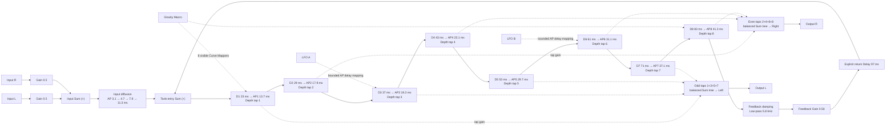

# Gravity Diffusion topology design

M9.1 fixes the audio and control architecture before musical weighting or
tuning. This is an original project-authored network assembled only from the
public Stereo Input/Output, Gain, Sum, Delay, Allpass, Low-pass, Macro, LFO,
and Curve Mapper blocks. It introduces no factory-only audio processor.

## Signal topology

Solid arrows are mono audio. Dotted arrows are explicit mono control routes.
The compact stage boxes stand for separate public Delay and Allpass nodes, not
combined processors. The implementation expands every box and every balanced
sum tree into ordinary blocks and cables.

## Fixed delay and diffusion plan

| Part | Public nodes | Milliseconds | Purpose |
|---|---:|---|---|
| Input diffusion | 4 Allpass | `3.1, 4.7, 7.9, 11.3` | Break up the direct impulse before recirculation. |
| Depth stages | 8 Delay | `23, 29, 37, 43, 53, 61, 71, 83` | Create eight strictly deeper causal observation points. |
| Progressive diffusion | 8 Allpass | `13.7, 17.9, 19.3, 23.1, 29.7, 31.1, 37.1, 41.3` | Increase echo density as energy travels deeper. |
| Global return | 1 Delay | `97` | Make the outer feedback boundary explicit and legal. |

All 12 allpasses start at coefficient `0.5`. The input group plus one new
allpass at every stage makes a late tap pass through twelve diffusion sections,
while tap 1 passes through five. This deliberately creates progressive density
rather than three isolated weighted echoes.

The initial untuned tap gains are `0.24`. Odd depths `1/3/5/7` feed a balanced
three-Sum left tree; even depths `2/4/6/8` feed an independent three-Sum right
tree. Thus left and right observe different internal states and remain mono
cables all the way to the explicit stereo boundary. M9.2 will replace the
fixed tap gains with normalized visible Gravity mappings.

## Feedback legality and damping

Stage 8 feeds a visible 5.8 kHz Low-pass, Gain `0.58`, and 97 ms Delay before
returning to the second input of Tank-entry Sum. The only directed audio cycle
therefore contains the return Delay as well as all eight stage Delays. Removing
Delay nodes makes the graph acyclic, exactly matching the existing validator's
rule. Damping sits inside the return path so every recirculation loses high
frequency energy before re-entering stage 1.

The native design regression constructs the fully expanded 43-node/51-cable
audio graph and compiles it through the existing feedback compiler at 44.1,
48, 96, and 192 kHz. It requires one legal feedback component, no offending
algebraic loop, 12 Allpasses, eight tap gains, and the exact delay-memory bound.

## Planned visible control graph

M9.2 and M9.3 fill these routes without changing the audio topology:

- **Gravity:** one designated Macro branches through eight visible Curve
  Mappers to the eight tap gains.
- **Size:** one Macro branches directly to the 8 stage Delays, 12 Allpass
  delays, and return Delay: 21 explicit parameter mappings.
- **Feedback:** one Macro maps to the visible feedback Gain.
- **Damping:** one Macro maps to the return Low-pass cutoff.
- **Modulation:** two independent slow LFOs each branch to two selected stage
  Allpass delay sockets. Exact rates/depths are deferred to M9.3.

This worst case is 15 control-participating nodes (five Macros, eight Curve
Mappers, two LFOs) and 35 connected parameter mappings. It is below the fixed
limits of 64 control nodes and 128 mappings. No destination is stored outside
the visible graph.

## Resource and transition budget

The maximum supported planning rate is 192 kHz. Each Allpass reserves 100 ms
plus one guard sample for continuous delay editing. Exact worst-case storage is:

| Resource | Design | Project limit / margin |
|---|---:|---:|
| Total nodes after planned controls | `58` | `256` / 198 spare |
| Audio connections before controls | `51` | `512` / 461 spare |
| Delay-bearing lines | `21` | `64` / 43 spare |
| Delay samples at 192 kHz | `95,424` | included below |
| Allpass arena samples at 192 kHz | `230,412` | included below |
| Total delay arena | `325,836 samples = 1,303,344 bytes` | `64 MiB` / 98.1% free |
| Two-runtime crossfade delay arenas | `2,606,688 bytes` | prepared off-thread |
| Control nodes / mappings | `15 / 35` | `64 / 128` |

A conservative implementation accounting assigns 320 scalar arithmetic or
buffer operations per sample to one runtime, including routing overhead. That
is at most 61.44 million operations/second at 192 kHz. The fixed 10 ms topology
crossfade temporarily doubles it to 640 operations/sample (122.88 million/s)
and doubles prepared delay storage to the value above; it never creates a third
audible runtime. These are M9 implementation ceilings, not measured CPU claims.
M9.6 must measure real hosts and tighten the budget if necessary.

At the normal 48 kHz target the same topology uses roughly one quarter of the
delay samples. Audio-thread work is fixed by prepared node/connection counts,
with no topology discovery, allocation, locking, or logging.

## Decisions intentionally deferred

M9.1 does not claim that `0.24`, `0.58`, or the nominal delays are musically
final. M9.2 defines normalized Gravity weights; M9.3 adds the complementary
macros and modulation; M9.4 measures and tunes Inverse/Bloom/Forward. The fixed
items here are architecture, signal ownership, legal feedback boundary, stereo
tap partition, and maximum resource envelope.
