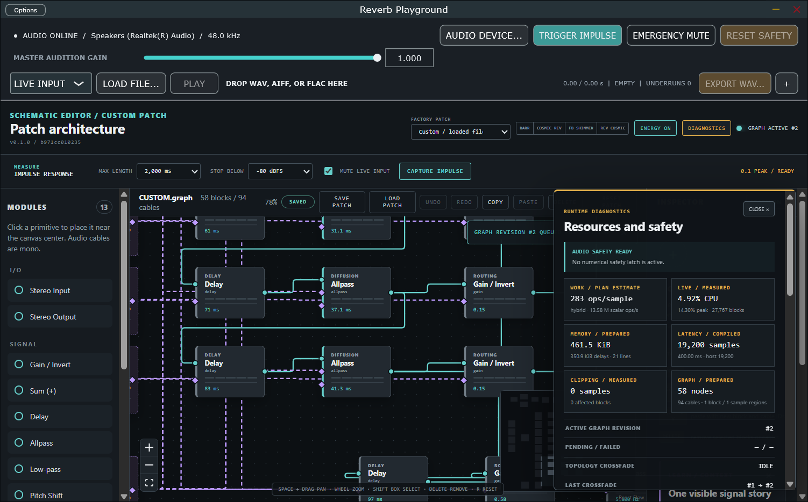

# Hybrid execution regions

Status: implemented in M17.1

The visible schematic remains the program. During off-thread compilation, the scheduler finds every delay-containing strongly connected component and assigns it a stable region identity. Nodes in each feedback region execute with the causal sequence `Delay read → evaluate region → Delay write` for every sample. Prepared spans outside those regions process whole host blocks.

Envelope Follower and Hold Gate form a sample-wise causal span from detector to gate. A single visible control mapper may sit between them without introducing runtime graph discovery. Unrelated branches stay block-wise.

## Scheduling guarantees

- Feedback regions are ordered deterministically and kept separate when their intervals do not overlap.
- Ready acyclic work is scheduled before feedback work when dependencies permit, minimizing the sample-wise span.
- Nested loops in one strongly connected component share one causal region; independent loops retain separate regions.
- Algebraic loops without a Delay retain the existing exact rejection diagnostics.
- Region boundaries, operation records, processors, buffers, and modulation ramps are fully prepared before publication. The callback allocates nothing, locks nothing, and performs no graph traversal.

The runtime diagnostics panel reports `block-wise`, `sample-wise`, or `hybrid`, plus block-wise and sample-wise region counts. The sample-wise dispatch estimate now counts only operations inside those regions.

## Qualification

The checked [M17.1 performance matrix](../artifacts/measurements/performance-matrix-m17-1.json) repeats the M16 75-case Release matrix and records region counts. All flagship outputs remain finite and within the M16 callback budgets. Median per-graph p95 changes are small-to-improving on the reference run (approximately 0% for feed-forward Barr and reductions for all four feedback factories); M17.4 will perform the final repeated qualification after liveness and kernel work, so isolated timing noise is not treated as a product claim.

Existing golden renders and focused tests cover recurrence, host-block partition independence, nested and independent feedback loops, modulation, follower/gate causality, safety recovery, reset, state restoration, and topology crossfades.

Changing independent feed-forward spans from scalar graph traversal to block processing changes floating-point accumulation order slightly. The refreshed deterministic shimmer measurements move by less than 0.02 dB in the primary halo balance and about 0.54 dB only in an already suppressed component roughly 50 dB below that halo; topology, pitch bands, safety bounds, and qualitative acceptance remain unchanged. The checked artifacts make that boundary explicit instead of claiming bit identity across executor domains.

## UI evidence

The reviewed Release standalone capture shows a live hybrid plan and its explicit region counts:

