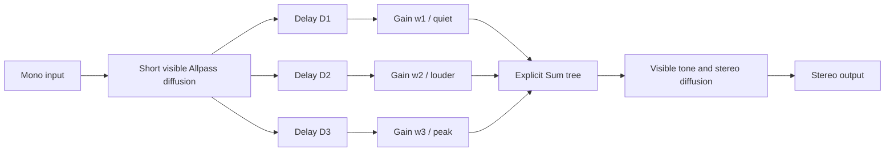

# Reverse, inverse, gated, and Bloom architecture requirements

M6 uses four names for four different signal behaviors. They are not interchangeable marketing synonyms. Factory patches, teaching text, measurements, and code must use the definitions below.

## Product vocabulary

| Product term | Signal definition | Audible result | Impulse-response evidence |
|---|---|---|---|
| **True time reversal** | Reverse a finite recorded source/reverb result, or convolve with an exactly reversed finite impulse response: `h_rev[n] = h[N - 1 - n]`. A swell that peaks *before* the dry event requires offline processing or lookahead equal to the lead time. | Individual echoes, modulation, and noise grain run backward, not merely the loudness envelope. With lookahead/offline placement, the wet peak can lead into the dry transient. | Sample order is the exact reverse of the source IR within the chosen window. Smoothed energy usually rises toward the terminal peak; microstructure is reversed too. |
| **Causal reverse-envelope approximation** | Construct a new causal response whose energy rises: `h_env[n] = sum(w_k * d[n - D_k])`, with explicit increasing tap weights `w_k` and delays `D_k`, followed by a finite end or decay. It does not reverse `d[n]`. | A reverse-like swell occurs *after* each input event with no lookahead. Echo texture still runs forward. Overlapping notes remain a normal linear superposition rather than sharing a trigger envelope. | The smoothed envelope rises to a late peak, but sample-level correlation with a reversed reference is neither required nor claimed. Visible weighted branches prove how the rise was made. |
| **Gated reverb** | Apply a gate/window to a dense reverb. A **level-gated** version opens from an envelope follower and closes after threshold/hold/release; a **fixed gated envelope** uses a deterministic time window independent of input level. These names must remain distinct in the inspector. | A dense room/plate stays present for a hold interval and then stops abruptly. It need not rise, and a retriggerable level gate may react differently to sustained versus percussive input. | Energy is dense before a clearly measurable cutoff. The defining evidence is truncation, not a late peak. The view must mark open/hold/release/cutoff regions when the relevant controls exist. |
| **Bloom-like slow attack** | Grow density through cascaded diffusion/allpass behavior and then decay smoothly. It may have feedback and modulation, but no exact reversal or gate is implied. | A soft, increasingly dense wash grows and then trails away. The transition through the peak is smooth rather than an abrupt terminal cut. | Echo density and smoothed energy build slowly, then exhibit a nonzero smooth decay tail. A long diffuse attack alone proves Bloom-like behavior, never true reversal. |

The Bloom definition follows the MIDIVerb II description preserved in the [ValhallaShimmer Bloom notes](https://www.valhalladsp.com/shimmer/ValhallaShimmerNotes.pdf): programs 45 and 49 rise into a rich diffuse reverb and then decay smoothly. The [Lexicon PCM 80 Inverse description](https://lexiconpro.com/en-US/products/pcm80) independently demonstrates why an adjustable rise/level/decay segment with abrupt cutoff is an inverse envelope rather than literal signal reversal or a level-dependent gate. Product manuals describe behavior, not hidden topology; implementation claims remain limited accordingly.

## Chosen first reverse method

The first factory construction is **Causal Reverse Envelope**. That exact name is normative in UI and documentation; a short label may be **Reverse Envelope**, never bare **Reverse** or **True Reverse**.

It is real-time feasible because it is a causal, time-invariant network of already public primitives:

1. short Allpass diffusion creates a compact forward-running texture;
2. parallel Delay branches place copies at increasing millisecond offsets;
3. explicit Gain blocks increase branch weights toward the chosen peak time;
4. explicit Sum blocks combine the mono cables;
5. tone/diffusion and stereo terminal branches remain visible like any other patch.

The ordering contract is `D1 < D2 < D3` and `|w1| < |w2| < |w3|`; real patches may use more branches but may not collapse them into an opaque reverse block.

This adds no lookahead, reported plugin latency, onset detector, per-note voice allocator, runtime allocation, or hidden convolution. The maximum Delay determines how long the response takes to reach its peak, not input-to-output latency in the host sense. Existing graph publication, memory limits, crossfades, and numerical guards apply unchanged.

The construction is intentionally an envelope approximation. It does not reverse echo order, place wet energy before an un-delayed dry event, or reproduce an arbitrary captured response backward. Those capabilities remain a separately named future architecture requiring one of these explicit contracts:

- offline source/reverb/source reversal;
- a declared-lookahead processor with host latency compensation; or
- convolution with a user-visible, finite reversed IR asset whose output follows the input event.

## Minimum new primitives for M6.2

No new primitive is required for **Causal Reverse Envelope**: Delay, Gain, Sum, Allpass, and Low-pass already expose every operation. A bundled tap-bank macro is rejected because it would hide the very weights and delays the instrument is meant to teach.

Gated construction requires exactly two new reverb-specific primitives:

### Envelope Follower

- mono audio input, mono control output;
- absolute-peak detector with explicit attack and release in milliseconds;
- normalized finite output `0...1` and deterministic reset;
- prepared coefficients at the host sample rate, with no allocation or locks while processing;
- a visible control cable so the gate's cause is inspectable.

### Hold Gate

- mono audio input/output plus one mono control input;
- threshold, hold, and release in milliseconds; attack is a short explicit millisecond parameter rather than a hidden de-clicker;
- deterministic open/hold/release state, retrigger policy, and reset;
- no lookahead by default and no implicit detector, limiter, diffusion, or feedback;
- bounded gain `0...1`; it cannot create feedback energy by itself, but tests must cover placement inside a legal delayed feedback loop.

Existing Scale / Offset remains available between follower and gate for explicit polarity/range mapping. A fixed inverse/gated envelope can later use an explicit time-window control source, but M6.2 must not add one until a factory construction proves it necessary.

## Measurement and naming contract

M6.3 fixtures must use the same impulse capture and a documented smoothed-energy window for comparisons. At minimum they report onset, time to peak, peak-to-cutoff time, residual energy after cutoff, and whether a conventional RT60 is meaningful.

Factory naming rules are normative:

- **True Reverse** requires exact sample-order reversal evidence and disclosed offline/lookahead/convolution behavior.
- **Reverse Envelope** requires visible increasing tap weights and a measured late energy peak; a slow allpass build alone is insufficient.
- **Gated** requires a measured abrupt cutoff and must say **Level-Gated** or **Fixed Gated Envelope**.
- **Bloom** requires a measured slow density/energy rise followed by a smooth nonzero decay tail.
- No patch is labeled **reverse** solely because it has a long diffuse attack.

These rules deliberately prefer an honest name over historical preset shorthand. Historical notes may say that MIDIVerb II called Bloom programs variations on a reverse-reverb theme, but the product label remains **Bloom** unless the visible graph satisfies the Reverse Envelope contract above.

## Deferred decisions

The following are explicitly outside M6.1/M6.2 and require their own acceptance criteria before implementation:

- user-supplied IR import, storage, licensing, and convolution budgets;
- host latency reporting and dry-path compensation for pre-echo lookahead;
- onset-triggered polyphonic envelope voices for overlapping notes;
- automatic transient detection or source separation;
- a compact tap-bank presentation that still expands to truthful public primitives.
